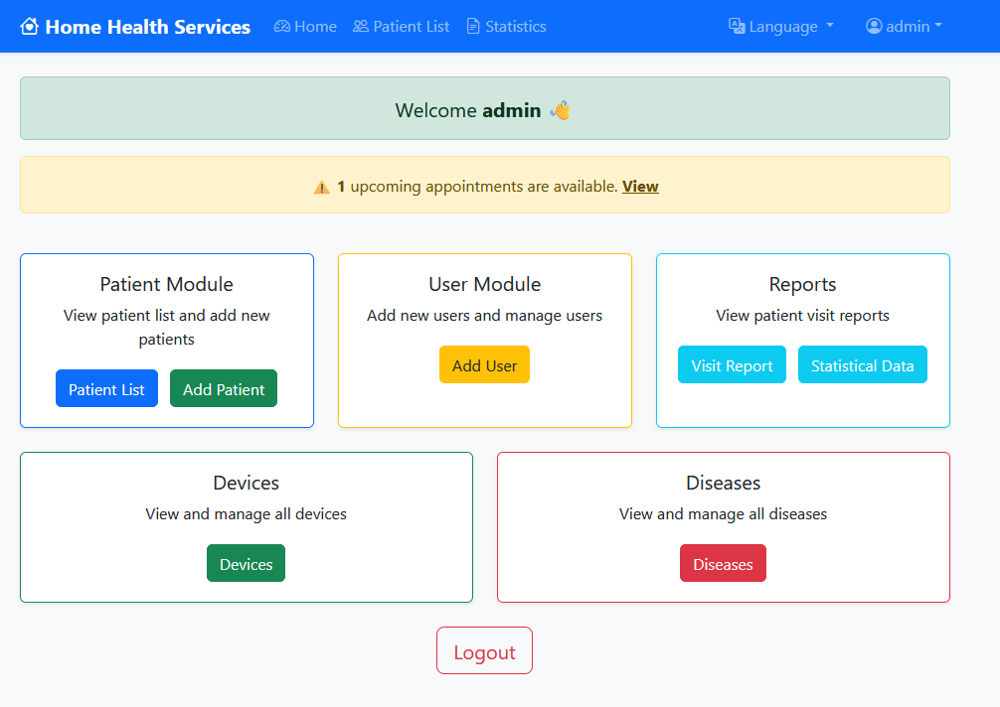

# Save this as create_readme.py and run it with Python
readme_content = """# 🏥 Home Health Services Management System

The **Home Health Services Management System** is a comprehensive web application designed to help home healthcare providers manage patient tracking, user management, statistics analysis, and reporting processes digitally.

---

## 🚀 Features

### 🏠 Dashboard
- Admin welcome screen  
- Upcoming appointment notifications  
- Quick module access  
- Overall system summary
- 


### 👤 Patient Module
- View, search, and filter patients  
- Access patient detail pages  
- Edit patient information  

### 🛠 Patient Detail Operations
- Add visits  
- Add diagnoses or medical conditions  
- Assign medical devices  
- Track operation history  

### 👥 User Management
- Add new users  
- Role-based authorization  
- Edit user information  

### 📊 Statistics
- Filter by date range  
- Total services provided  
- Patients registered and discharged per month  
- Gender-based patient distribution  
- Service start/end statistics  
- Reasons for service termination  
- Active patients’ condition distribution  

### 📄 Reporting
- View patient visit reports  
- Export to Excel  
- Filter reports by date  

### 🏥 Device & Disease Management
- View, add, edit, and delete devices  
- Assign devices to patients  
- Manage disease groups and statistics  

### 🌍 System Features
- Multi-language support  
- Admin user system  
- Role-based permissions  
- Appointment tracking  
- Dynamic statistics dashboard  
- Excel export support  
- Responsive design  

---

## 🧰 Technologies
This project is built using Bootstrap, MySQL, HTML, CSS, and JavaScript.

---


## 📦 Installation & Usage

Follow these steps to run the project locally:

```bash
# 1. Download the ZIP file and extract it
unzip Home-Health-Services.zip
cd Home-Health-Services

# 2. Import the database
# The database is included in the 'DB-Home-Health-Services.sql' file.
# Import it into your MySQL server, then open 'config/Database.php' and set your database connection settings (host, username, password, database name)

# 3. Install all dependencies
npm install

# 4. Start the application
npm start

# 5. Open your browser at
# http://localhost:3000

# 6. Login to the system using the default credentials:
# Username: deneme
# Password: 1!PassPass!1
